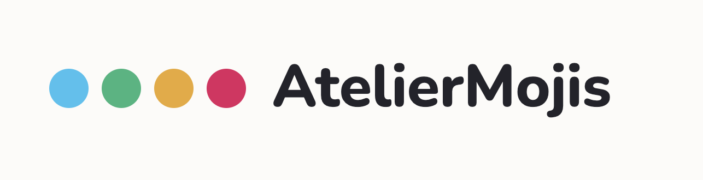

# AtelierMojis



Turn images into slack emoji 🎨

## Getting Started

Run locally:

```bash
corepack enable
```

```bash
pnpm install && pnpm prepare
pnpm dev
```

Then open `http://localhost:8080`.

## Features

- **No upload**: your files stay on your machine.
- **Local-first**: processing happens in the browser.
- **Built for Slack**: perfect for creating custom Slack emojis.

## AI-driven development

Except a few exceptions, this project was mostly generated using latest AI tooling: [Lovable](https://lovable.dev/), [Codex](https://chatgpt.com/codex/) & [opencode](https://opencode.ai/). I still had to manually go through some things like Github actions to generate a proper CI 😬 It's still not perfect, but for UI and TS changes it's pretty crazy.

Read the backstory in [`docs/STORY.md`](docs/STORY.md).

In this repo you'll find a collection of skills under `.agents` to let your agents be smarter with this repo tooling. As the project evolves, please feel free to update them :)

## About

A Gitnotifier Labs project: [gitnotifier.com](https://www.gitnotifier.com/?utm_source=github&utm_medium=readme&utm_campaign=ateliermojis)

## Contributing

See `CONTRIBUTING.md` for development workflow and pull request guidelines.

## Security

See `SECURITY.md` for responsible vulnerability disclosure.

## License

This project is licensed under the MIT License. See `LICENSE`.
